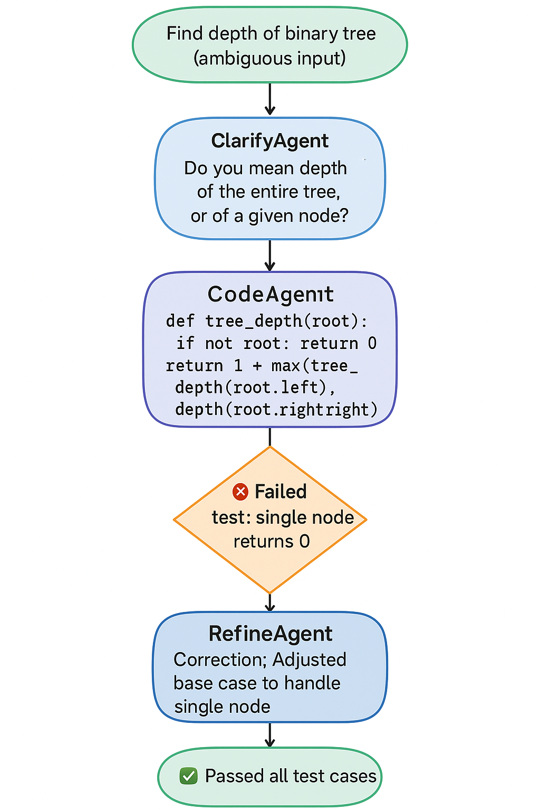
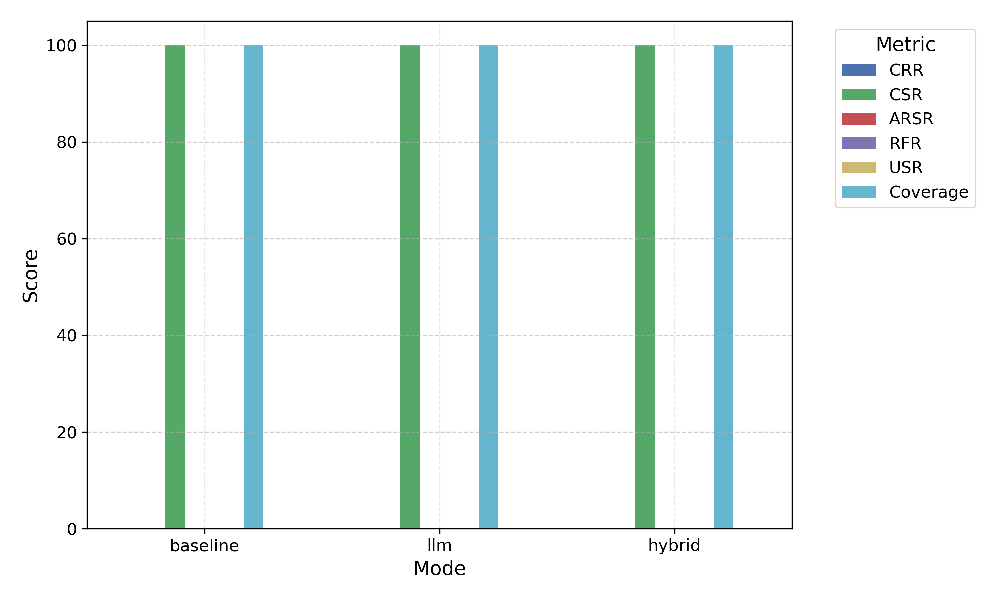
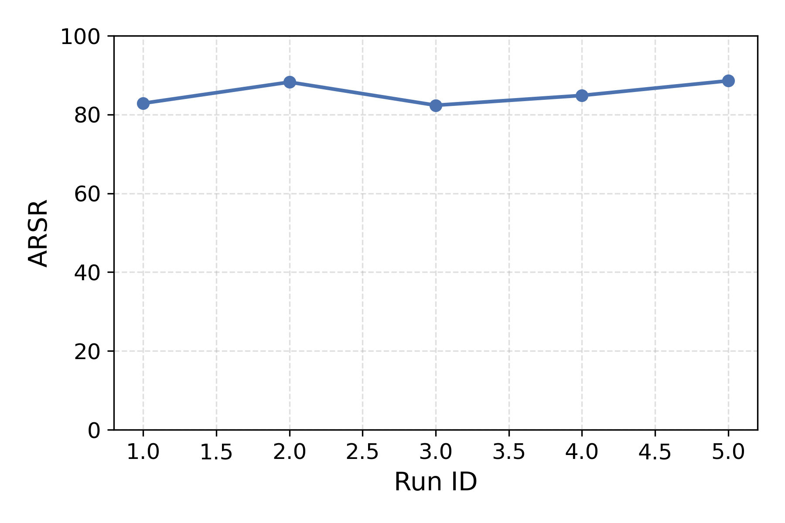
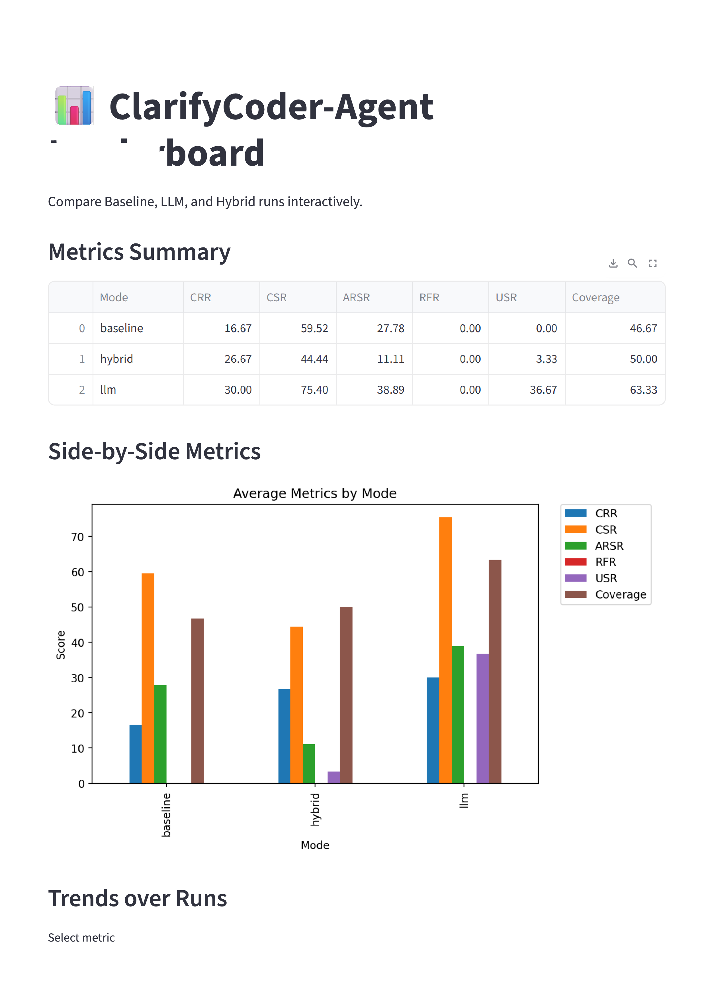

# ⚙️ ClarifyCoder-Agent – Backend

<p align="center">
  
</p>

> **ClarifyCoder-Agent** is a **multi-agent system for ambiguity resolution in code generation**.  
> It splits responsibilities across **specialist agents** (Clarify, Answer, Code, Eval, Refine) and introduces new evaluation metrics (ARSR, CRR, CSR, RFR, USR).  
> This backend powers the research pipeline and connects with the frontend UI.

---

## ✨ Core Features

- 🔹 **Multi-Agent Flow** → ClarifyAgent → AnswerAgent → CodeAgent → EvalAgent → RefineAgent
- 🔹 **Dual Implementations** → Baseline (rule-based) and LLM (GPT-4o-mini)
- 🔹 **Ambiguity Dataset** (`prompts.jsonl`) → ambiguous + clear coding tasks
- 🔹 **Novel Metrics**: ARSR, CSR, CRR, USR, RFR
- 🔹 **Self-Repair Loop** → EvalAgent feedback guides RefineAgent for iterative fixes
- 🔹 **Experiment Runner** → baseline vs LLM vs hybrid comparison
- 🔹 **Visualization** → Matplotlib plots + Streamlit leaderboard dashboard
- 🔹 **Human-in-the-Loop Mode** → interactive Q&A vs fully automated LLM answers

---

## 📂 Project Structure

```plaintext
clarifycoder-backend/
 ├─ agentic_clarifycoder/
 │   ├─ core/
 │   │   ├─ agents/
 │   │   │   ├─ answer_agent.py
 │   │   │   ├─ clarify_agent_llm.py
 │   │   │   ├─ clarify_agent_rulebased.py
 │   │   │   ├─ code_agent_llm.py
 │   │   │   ├─ code_agent_rulebased.py
 │   │   │   ├─ eval_agent_llm.py
 │   │   │   ├─ eval_agent_rulebased.py
 │   │   │   ├─ refine_agent_llm.py
 │   │   │   └─ refine_agent_rulebased.py
 │   │   ├─ demo/
 │   │   │   └─ demo.py              # CLI demo runner
 │   │   ├─ utils/
 │   │   │   └─ runner.py            # Logging & helpers
 │   │   └─ __init__.py
 │   ├─ plots/                       # Generated experiment plots
 │   ├─ logs/                        # Experiment logs
 │   ├─ clarify_agent_clarifycoder.py
 │   ├─ compare_experiments.py       # Experiment runner + plots
 │   ├─ dashboard.py                 # Streamlit leaderboard
 │   ├─ prompts.jsonl                # Ambiguity dataset
 │   └─ __init__.py
 ├─ results.csv / results.xlsx       # Experiment results
 ├─ app.py                           # FastAPI entrypoint (for frontend integration)
 ├─ requirements.txt                 # Dependencies
 ├─ pyproject.toml
 ├─ Procfile                         # Heroku/Render deployment
 └─ README.md
```
---

## 🧩 Agent Responsibilities

| Agent         | Function                                   | Baseline Implementation | LLM Implementation |
|---------------|--------------------------------------------|--------------------------|---------------------|
| **ClarifyAgent** | Detects ambiguous prompts, generates clarifying Qs | Regex/Rule-based        | GPT-4o-mini         |
| **AnswerAgent**  | Provides answers to clarifications       | Human input (CLI/Web)   | GPT-4o-mini         |
| **CodeAgent**    | Generates candidate Python code          | Templates (deterministic) | GPT-4o-mini       |
| **EvalAgent**    | Runs/evaluates code correctness          | Test cases & keyword checks | GPT-4o-mini      |
| **RefineAgent**  | Repairs failed code using feedback       | Simple text rules       | GPT-4o-mini         |

## 🔀 Modes of Operation

| Mode       | ClarifyAgent | CodeAgent | EvalAgent | RefineAgent | AnswerAgent |
|------------|-------------|-----------|-----------|-------------|-------------|
| **Baseline** | Rule-based  | Templates | Test cases & keyword checks | Simple text rules | Human (CLI/Web) |
| **LLM**      | GPT-4o-mini | GPT-4o-mini | GPT-4o-mini | GPT-4o-mini | GPT-4o-mini |
| **Hybrid**   | GPT-4o-mini | Rule-based | Rule-based | GPT-4o-mini | Human/LLM |

## 📂 Dataset of Ambiguous Prompts

The system ships with a small benchmark dataset: **`prompts.jsonl`**.

Each line is a JSON object with:
- **prompt** → original ambiguous/clear task  
- **clarifications** → clarification questions generated  
- **solution** → expected clarified solution  
- **failure_mode** → expected incorrect outcome if clarification is skipped  

📌 Example entry:
```json
{
  "id": 1,
  "prompt": "Find depth of binary tree",
  "clarifications": ["Do you mean depth of the entire tree, or a given node?"],
  "solution": "Function to compute max depth of full binary tree",
  "failure_mode": "If skipped → code may compute depth of only root"
}
```

## 📊 Evaluation Metrics

| Metric | Formula | Meaning |
|--------|---------|---------|
| **ARSR** | (# resolved ambiguous prompts with correct code) ÷ (total ambiguous prompts) | Ambiguity-Resolved Success Rate |
| **CSR**  | (# correct clear prompts) ÷ (total clear prompts) | Clear Success Rate |
| **CRR**  | (# prompts needing clarification) ÷ (total ambiguous prompts) | Clarification Request Rate |
| **USR**  | (# ambiguous solved without clarification) ÷ (total ambiguous prompts) | Unresolved Success Rate |
| **RFR**  | (# successful refinements) ÷ (total refinement attempts) | Refinement Fix Rate |

---

## 🚀 Running the System

### 1. Install Dependencies
```bash
git clone https://github.com/hsb-amjad/clarifycoder-backend.git
cd clarifycoder-backend
pip install -r requirements.txt
```

### 2. Run Demo
```bash
# Baseline-only agents
python -m agentic_clarifycoder.core.demo.demo --clarify_mode baseline --code_mode baseline --eval_mode baseline --refine_mode baseline --answer_mode human

# LLM-only agents
python -m agentic_clarifycoder.core.demo.demo --clarify_mode llm --code_mode llm --eval_mode llm --refine_mode llm --answer_mode auto
```
- answer_mode can be switched between auto and HIL.

### 3. Run Comparison-Experiments
```bash
cd agentic_clarifycoder
python compare_experiments.py --n_prompts 10 --runs 3 --answer_mode auto
```
#### Args:
```lua
--n_prompts   Number of prompts (default: random 5–10)
--runs        runs per mode
```
- answer_mode can be switched between auto and HIL.
#### Generates:
- 📊 results.csv and results.xlsx
- 📈 Plots in /plots
- 📝 Logs in /logs/<timestamp>/

### 4. Streamlit Dashboard
```bash
streamlit run dashboard.py
```
Interactive leaderboard with metrics, plots, and raw log inspection.

---

## 📊 Example Outputs

### 📈 Bar Chart of Metrics (Baseline vs LLM vs Hybrid)
<p align="center">
  
</p>

### 📉 Trend Plots for ARSR
<p align="center">
  
</p>

### 🖥️ Dashboard
<p align="center">
  
</p>

---

## 🔬 Research Contribution

- 📑 Novelty: First ambiguity-aware benchmark for code generation
- 📊 Metrics: ARSR introduced + supporting metrics for clarity, refinement, unresolved cases
- 🔄 Self-repair loop: Evaluation → refinement cycle for robustness
- 👤 Human-in-the-Loop: Compare human clarifications vs auto-LLM clarifications
- 📈 Evaluation: Supports HumanEval + MBPP + custom ambiguity dataset
- 🎯 Hybrid configuration: Best balance between reproducibility (rules) and flexibility (LLMs)

---

## 📚 Citation

If you use ClarifyCoder-Agent in academic work:
```bibtex
@misc{clarifycoder2025,
  title={ClarifyCoder-Agent: Multi-Agent Coding Assistant with Ambiguity Resolution},
  author={Amjad, Haseeb},
  year={2025},
  howpublished={GitHub},
}
```

## ⭐ Support

If this project helps your research, please star ⭐ the repo.
Contributions and feedback are welcome!

## 👤 Author

**Haseeb Amjad** – Mechatronics Engineer | Machine Learning | AI + Robotics | MedTech  
🌐 [Portfolio](https://my-portfolio-sage-zeta-79.vercel.app)
💼 [LinkedIn](https://www.linkedin.com/in/hsb-amjad)
